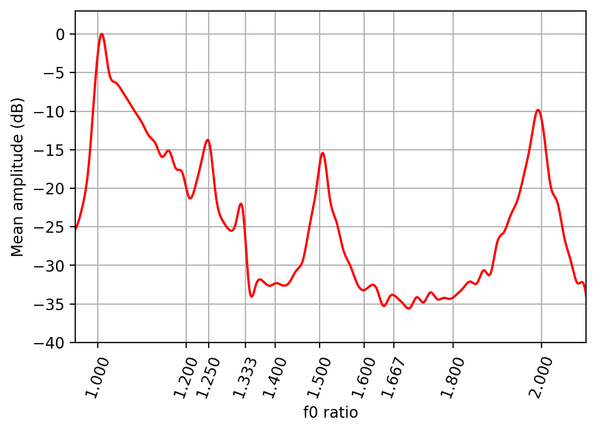

# consynthance
Studying consonance as a result of vocal similarity  


Mean spectrum at different frequency ratios from 100 examples of english speech.

## Usage 

You'll need to install [essentia](https://essentia.upf.edu/documentation/), which has a platform dependant installation process. \
(See [here](https://essentia.upf.edu/documentation/installing.html).)

On macOS you can do this with [homebrew](https://brew.sh/).
```
brew tap MTG/essentia
brew install essentia --HEAD --without-python@2
```

If  you are using virtualenv make sure to include site packages for this to work.
```
python3 -m venv env/ --system-site-packages 
```

Install requirements.
```
pip install -r requirements.txt
```

Launch the notebooks.
```
jupyter notebook
```

Note: developed with Python 3.7 and requires Python 3.6 or above.

## Data
To start we are using the [Common Voice dataset](https://voice.mozilla.org/en/datasets) from Mozilla, which provides nearly 70GB of speech data from 30 different languages. 

Downloading this data is easy with the provided bash script. 
Run the `data.sh` bash script as follows, where the command line argument specifies a directory to store the data.
This will take a while to complete, probably in the range of 2-4 hrs depending on your downloaded speed. 

```
$ ./data.sh /dir/to/store/output
```